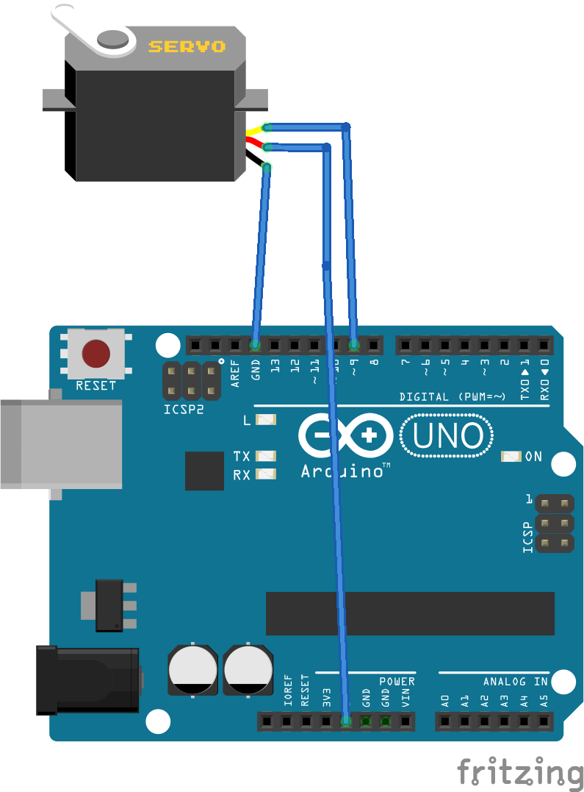

# ServoSlider

Servo connected to an Arduino and controled by a circular slider slider in a web page served by an node.js application. This app has been made for education purposes.

## Tech

This application uses the following techologies:
* [Arduino board]: with firmata protocol loaded.
* [node.js]: A JavaScript environment for the OS.
* [serialport]: Is a module to send and receive data, through serial port, from the arduino in a JavaScript application.
* [Jonny-five]: A library to control components that are usually connected to an arduino board such as leds, servos, ...
* [Express]: Is a module to serve pages to a web browser.
* [socket.io]: To send and receive messages between a browser (client) and a node.js application (server)
* [Round Slider]: Jquery plugin to insert round sliders in a web page.

## Prerequisites

The follogwing are required to run this application:
* Install the FDTI drivers in the computer where the aruino is attached to. This makes the usb port to be used as a serial port.
* An arduino UNO board.
* The arduino IDE.
* firmata protocol loaded. In de Arduino IDE, load the schetch StandardFirmata.ino to the arduino.
* Servo connected to pin 9 (see connection diagram). Vcc and GND are connected to arduino +5V and GND pins respectively.
* Download and install node.js in your computer to run javascript applications.

## Installing

1. Copy the files in a directory of your choice and type: _npm install_. This will install all the modules specified in the file _package.json_
2. Find which serial port is used to connect with the arduino. See in the arduino IDE or in the Device Manager in Windows. By default the serial port is COM5, so in the app.js file set the line: _board = new five.Board({port: "COM5"});_ to _board = new five.Board({port: "COMX"});_ where X is your serial port assigned.

## Running the tests

To run the application do the following:
1. In your working directory type: _node app.js_
2. In your web browser load the page: _localhost:3000_

## Version

1.0.0 

## Authors

* **Luis Cárceles** - *Initial work* - [GitHub ServoSlider]

## License

This project is licensed under the MIT License - see the [LICENSE.md](LICENSE.md) file for details

## Connection diagram

This diagram has been made with [Fritzing].

[Arduino board]: http://arduino.cc
[node.js]: http://nodejs.org
[serialport]: https://serialport.io
[Jonny-five]: http://johnny-five.io
[Express]: https://expressjs.com
[socket.io]: https://socket.io
[Round Slider]: http://roundsliderui.com
[GitHub ServoLedSlider]: https://github.com/luisC62/ServoSlider
[Fritzing]: https://fritzing.org/home/

